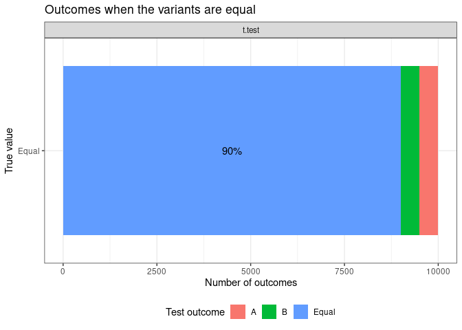
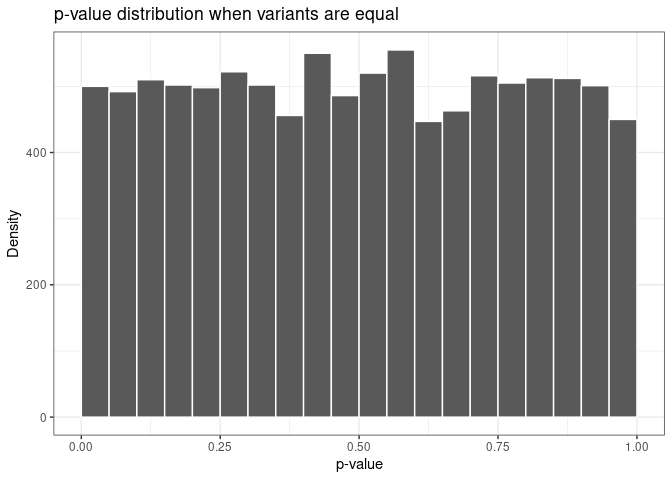
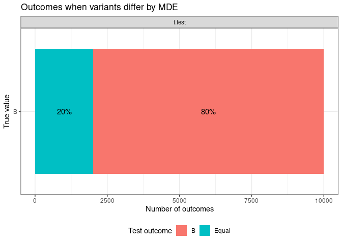
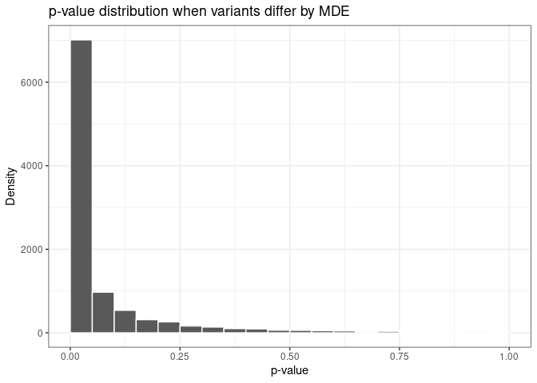
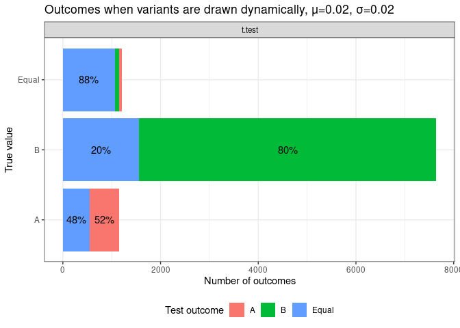
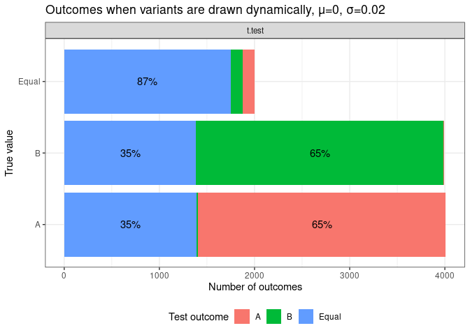

Null hypothesis testing
================

``` r
library(tidyverse)
```

    ## Warning in system("timedatectl", intern = TRUE): running command 'timedatectl'
    ## had status 1

    ## ── Attaching packages ─────────────────────────────────────── tidyverse 1.3.2 ──
    ## ✔ ggplot2 3.4.0     ✔ purrr   1.0.1
    ## ✔ tibble  3.1.8     ✔ dplyr   1.1.0
    ## ✔ tidyr   1.2.1     ✔ stringr 1.5.0
    ## ✔ readr   2.1.3     ✔ forcats 0.5.2
    ## ── Conflicts ────────────────────────────────────────── tidyverse_conflicts() ──
    ## ✖ dplyr::filter() masks stats::filter()
    ## ✖ dplyr::lag()    masks stats::lag()

``` r
library(ggplot2)
library(kableExtra)
```

    ## 
    ## Attaching package: 'kableExtra'
    ## 
    ## The following object is masked from 'package:dplyr':
    ## 
    ##     group_rows

``` r
library(scales)
```

    ## 
    ## Attaching package: 'scales'
    ## 
    ## The following object is masked from 'package:purrr':
    ## 
    ##     discard
    ## 
    ## The following object is masked from 'package:readr':
    ## 
    ##     col_factor

``` r
#setup
alpha = 0.1
power = 0.8
baseline_conversion_rate = 0.42
minimum_detectable_effect = 0.02
no_simulations = 10000
```

``` r
power_calcs = power.prop.test(
  p1=baseline_conversion_rate, 
  p2=baseline_conversion_rate + minimum_detectable_effect,
  sig.level = alpha,
  power = power
)

n = ceiling(power_calcs$n)
print(power_calcs)
```

    ## 
    ##      Two-sample comparison of proportions power calculation 
    ## 
    ##               n = 7575.677
    ##              p1 = 0.42
    ##              p2 = 0.44
    ##       sig.level = 0.1
    ##           power = 0.8
    ##     alternative = two.sided
    ## 
    ## NOTE: n is number in *each* group

# Reusable functions

``` r
#create a class for sharing metadata oop style
setRefClass("SimulationStepMetaData", fields=list(metadata="list"))


#runs the simulation rep number of times
simulate = function(generators, tests, sample_size, reps) {
  lapply(1:reps, function(i) {
    
    metadata = new("SimulationStepMetaData", metadata=list(sim_number = i))
    variants = lapply(generators, function(g) g(sample_size, metadata))
    lapply(tests, function(test) c(test(variants), metadata$metadata))
  })
}

#pulls a single attribute from result list (of lists of lists)
pull_attribute = function(results, attribute_name) {
  do.call(
    bind_rows, 
    t(lapply(results, lapply, function(test) test[[attribute_name]]))
  )
}

#wrapper around t-test
t.test_wrapper = function(variants, metadata = list()) {
  res = t.test(variants[[1]], variants[[2]])
  decision = case_when(
    res$p.value <= alpha && res$statistic > 0 ~ "A",
    res$p.value <= alpha ~ "B",
    TRUE ~ "Equal"
  )
  c(metadata, 
    list(
      decision = decision,
      pvalue = res$p.value, 
      statistic = res$statistic[['t']]
    )
  )
}
```

# Situation \#1: no effect

``` r
generator_A = function(n, metadata) rbinom(n=n, size=1, p=baseline_conversion_rate)
generator_B = function(n, metadata) rbinom(n=n, size=1, p=baseline_conversion_rate)

generators = list(generator_A, generator_B)
tests = list('t.test' = t.test_wrapper)

null_results = simulate(generators = generators, tests = tests, sample_size=n, reps=10000)
null_result_df = pull_attribute(null_results, 'decision') |>
  pivot_longer(everything(), names_to='test', values_to='decision') %>% 
  mutate(true_value = 'Equal')
```

``` r
plot_outcomes = function(df) {
  df |>
  group_by(test, true_value, decision) |> 
  summarize(count = n(), .groups = "drop_last") |>
  mutate(pct = count / sum(count)) |>
  ggplot(aes(y=true_value, x=count, fill=decision)) + 
  geom_col() + 
  geom_text(
    aes(label=if_else(pct >= 0.1, percent(pct, 1), "")), 
    position = position_stack(vjust = .5)
  ) + 
  labs(y="True value", x="Number of outcomes", fill='Test outcome') + 
  theme_bw() +
    theme(legend.position='bottom') +
    facet_wrap(~test, nrow=1)
  
}


plot_outcomes(null_result_df) + ggtitle("Outcomes when the variants are equal")
```

<!-- -->

``` r
ggsave('images/outcomes-under-null.png')
```

    ## Saving 7 x 5 in image

``` r
pull_attribute(null_results, 'pvalue') |> 
  ggplot(aes(x=t.test)) + geom_histogram(binwidth = 0.05, color='white', center=0.025) + 
  labs(title="p-value distribution when variants are equal", x="p-value", y="Density") + 
  theme_bw()
```

<!-- -->

``` r
ggsave('images/pvalues-under-null.png')
```

    ## Saving 7 x 5 in image

# Situation 2: fixed difference

``` r
generator_A = function(n, metadata) rbinom(n=n, size=1, p=baseline_conversion_rate)
generator_B = function(n, metadata) rbinom(n=n, size=1, p=baseline_conversion_rate + minimum_detectable_effect)

generators = list(generator_A, generator_B)

alt_results = simulate(generators = generators, tests = tests, sample_size=n, reps=10000)

pull_attribute(alt_results, 'decision') |>
  pivot_longer(everything(), names_to='test', values_to='decision') %>% 
  mutate(true_value = 'B') |>
  plot_outcomes() + ggtitle("Outcomes when variants differ by MDE")
```

<!-- -->

``` r
ggsave('images/outcomes-under-alternative.png')
```

    ## Saving 7 x 5 in image

``` r
pull_attribute(alt_results, 'pvalue') |> 
  ggplot(aes(x=t.test)) + geom_histogram(binwidth = 0.05, color='white', center=0.025) + 
  labs(title="p-value distribution when variants differ by MDE", x="p-value", y="Density") + 
  theme_bw()
```

<!-- -->

``` r
ggsave('images/pvalues-under-alternative.png')
```

    ## Saving 7 x 5 in image

# Dynamic draws with MDE

``` r
generator_A = function(n, metadata) rbinom(n=n, size=1, p=baseline_conversion_rate)
generator_B = function(n, metadata) {
  rv_mde = rnorm(1, mean=minimum_detectable_effect, sd=minimum_detectable_effect)
  metadata$metadata[['real_lift']] = rv_mde
  rbinom(n=n, size=1, p=baseline_conversion_rate + rv_mde)
}

generators = list(generator_A, generator_B)

dynamic_results = simulate(generators = generators, tests = tests, sample_size=n, reps=10000)
```

``` r
process_dynamic_results = function(df, round_lift=T, cutoff = 0, rounding = 2) {
  decisions = pull_attribute(df, 'decision') |>
  pivot_longer(everything(), names_to='test', values_to='decision')

  real_lifts = pull_attribute(df, 'real_lift') |>
    pivot_longer(everything(), names_to='test', values_to='real_lift')


  bind_cols(decisions, dplyr::select(real_lifts, real_lift)) |>
    mutate(real_lift = if_else(rep(round_lift,n()), round(real_lift, rounding), real_lift)) |>
    mutate(true_value = case_when(
      real_lift > cutoff ~ "B",
      real_lift < -cutoff ~ "A",
      TRUE ~ "Equal"
    )
  )
}

process_dynamic_results(dynamic_results) |>
plot_outcomes() + 
  ggtitle("Outcomes when variants are drawn dynamically, μ=0.02, σ=0.02")
```

<!-- -->

``` r
ggsave('images/outcomes-under-dynamic-02-02.png')
```

    ## Saving 7 x 5 in image

``` r
rv_mean_under_A = process_dynamic_results(dynamic_results) |> 
  filter(real_lift < -0.005) |> pull(real_lift) |> mean()
power.prop.test(
  p1=baseline_conversion_rate, 
  p2=baseline_conversion_rate + rv_mean_under_A,
  sig.level = alpha,
  n=n
)
```

    ## 
    ##      Two-sample comparison of proportions power calculation 
    ## 
    ##               n = 7576
    ##              p1 = 0.42
    ##              p2 = 0.4050044
    ##       sig.level = 0.1
    ##           power = 0.5909413
    ##     alternative = two.sided
    ## 
    ## NOTE: n is number in *each* group

``` r
generator_B = function(n, metadata) {
  rv_mde = rnorm(1, mean=0, sd=minimum_detectable_effect)
  metadata$metadata[['real_lift']] = rv_mde
  rbinom(n=n, size=1, p=baseline_conversion_rate + rv_mde)
}

generators = list(generator_A, generator_B)

dynamic_results_zero = simulate(generators = generators, tests = tests, sample_size=n, reps=10000)
```

``` r
process_dynamic_results(dynamic_results_zero) |>
plot_outcomes() + 
  ggtitle("Outcomes when variants are drawn dynamically, μ=0, σ=0.02")
```

<!-- -->

``` r
ggsave('images/outcomes-under-dynamic-00-02.png')
```

    ## Saving 7 x 5 in image

``` r
generator_B = function(n, metadata) {
  rv_mde = rnorm(1, mean=minimum_detectable_effect, sd=minimum_detectable_effect * 2)
  metadata$metadata[['real_lift']] = rv_mde
  rbinom(n=n, size=1, p=baseline_conversion_rate + rv_mde)
}

generators = list(generator_A, generator_B)

dynamic_results_large_sd = simulate(generators = generators, tests = tests, sample_size=n, reps=10000)
```

``` r
process_dynamic_results(dynamic_results_large_sd) |>
plot_outcomes() + 
  ggtitle("Outcomes when variants are drawn dynamically, μ=0, σ=0.04")
```

<!-- -->

``` r
ggsave('images/outcomes-under-dynamic-00-04.png')
```

    ## Saving 7 x 5 in image
